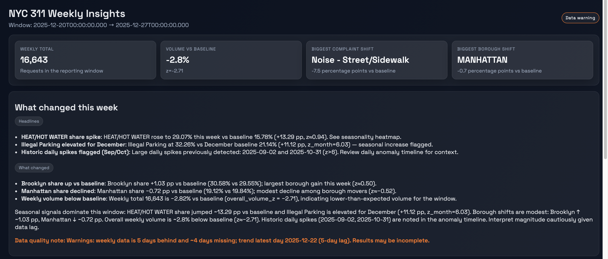
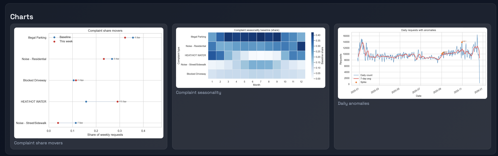
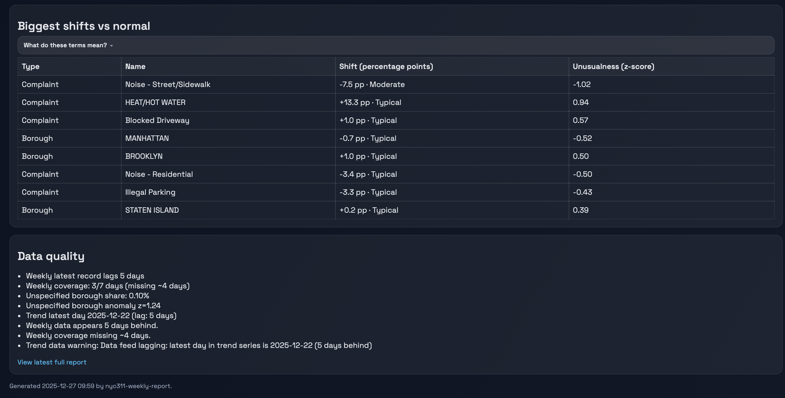

NYC 311 Weekly Report
=====================

A reproducible pipeline that ingests NYC 311 data, builds weekly and trend metrics, computes share-based insights, renders charts, generates an LLM narrative (optional), and publishes a lightweight dashboard site.

## Features
- Deterministic weekly metrics from raw NYC 311 snapshots (America/New_York windowing).
- Trend analytics with daily/weekly baselines and anomaly flags.
- Dashboard JSON with movers, seasonality, data-quality signals, and chart paths.
- Charts: complaint share dumbbell, complaint seasonality heatmap, daily anomaly timeline.
- Markdown/HTML weekly report plus a visual site with KPI cards and data-quality surfacing.

## Dashboard preview

The dashboard is generated locally.
Below are example screenshots from a recent run.


### Weekly overview


### Charts


### NYC 311 Shifts and Data Quality



## Project structure
- `data/raw/` — raw snapshots (`nyc311_last_*_days_*.json`).
- `data/processed/` — processed metrics (`weekly_metrics.json`, `trend_metrics.json`, `dashboard.json`, charts).
- `site/` — published static site (assets + reports).
- `reports/` — generated weekly Markdown reports.
- `src/nyc311_weekly_report/` — pipeline code and CLI (`nyc311`).

## Prerequisites
- Python 3.11+ with Poetry.
- OpenAI API key in env var `OPENAI_API_KEY` (only needed for `nyc311 narrate` / LLM narrative).

## Setup
```bash
poetry install
```
Activate the env with `poetry shell` (or prefix commands with `poetry run`).

## Quick start
```bash
poetry run nyc311 refresh --skip-narrate
```
This fetches data, computes metrics, builds charts, and publishes the site. Set `OPENAI_API_KEY` to run without `--skip-narrate` and generate the LLM narrative.

The dashboard (`site/`) is generated output and not committed.
Run the pipeline locally to produce it.

## CLI usage
All commands run via `poetry run nyc311 ...`.
- `ingest` — fetch last 7 days raw snapshot into `data/raw/`.
- `analyze` — build `data/processed/weekly_metrics.json` from latest raw.
- `trend` — fetch daily aggregates (default 365 days) into `data/processed/trend_daily.json`.
- `trend-analyze` — compute trend metrics (`trend_metrics.json`).
- `dashboard` — compute `dashboard.json` (insights, movers, anomalies) from weekly + trend data.
- `charts` — generate PNG charts into `site/assets/` and update `dashboard.json` with paths.
- `narrate` — call OpenAI to produce `data/processed/narrative.{json,md}`.
- `report` — render weekly Markdown report into `reports/weekly_report_*.md`.
- `publish` — build `site/index.html` and latest report HTML.
- `build-site` — render-only: dashboard → charts → narrate → report → publish (assumes processed data already exist).
- `refresh` — run-all: ingest → analyze → trend → trend-analyze → dashboard → charts → (optional narrate) → report → publish.

Typical end-to-end run:
```bash
poetry run nyc311 ingest --days 7
poetry run nyc311 analyze
poetry run nyc311 trend
poetry run nyc311 trend-analyze
poetry run nyc311 dashboard
poetry run nyc311 charts
poetry run nyc311 narrate   # requires OPENAI_API_KEY
poetry run nyc311 report
poetry run nyc311 publish
```

## Configuration notes
- Time zone: America/New_York.
- Raw file pattern: `nyc311_last_*_days_*.json` in `data/raw/` (latest file is used).
- “Unknown / Unspecified (missing borough)” is excluded from movers and only reported in data quality.

## Development
- Lint/format not configured; use your editor defaults.
- Tests are minimal; use `python -m py_compile src/nyc311_weekly_report/*.py` for a quick sanity check.
